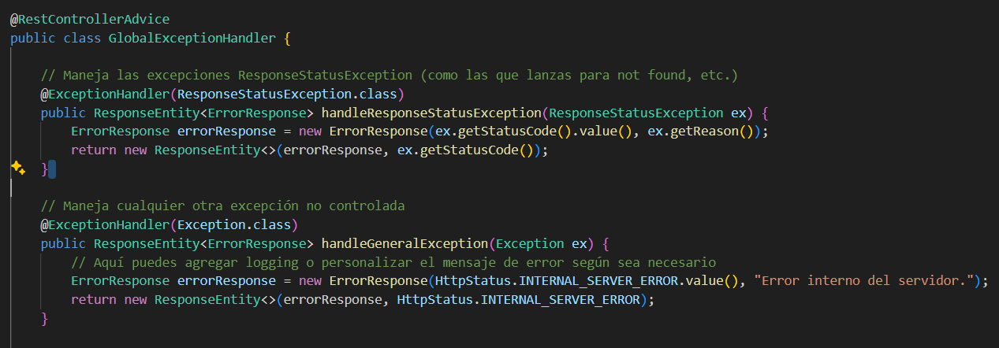

# 📌 API REST con Spring Boot, Maven, SQL Server y Actuator

Este proyecto es una API REST desarrollada con **Spring Boot** y **Maven**, que incluye:

- 📌 **Conexión a SQL Server** como base de datos  
- 📌 **Spring Boot Actuator** para monitoreo y métricas  
- 📌 **Manejo global de excepciones**  
- 📌 **Pruebas automatizadas con JUnit y Mockito**  

---

## 🚀 Tecnologías utilizadas

- ☕ **Java** (JDK 17 o superior recomendado)
- 🌱 **Spring Boot** (Framework principal)
- 📦 **Maven** (Gestión de dependencias y construcción del proyecto)
- 🛠️ **JUnit y Mockito** (Para pruebas unitarias e integración)
- 🗄️ **SQL Server** (Base de datos relacional)
- 📊 **Spring Boot Actuator** (Monitoreo y métricas)

---

## 📂 Estructura del proyecto

📁 API-Java----SQL-Server/ │── 📁 src/ │ ├── 📁 main/ │ │ ├── 📁 java/com/restapi/apirest/ │ │ │ ├── 📄 ApirestApplication.java │ │ │ ├── 📁 controller/ │ │ │ ├── 📁 service/ │ │ │ ├── 📁 repository/ │ │ │ ├── 📁 exception/ │ │ │ ├── 📁 entity/ │ │ ├── 📁 resources/ │ │ │ ├── 📄 application.properties │ ├── 📁 test/ │ │ ├── 📁 java/com/restapi/apirest/ │ │ │ ├── │ │ │ ├── 📄 ApiApplicationTests.java │── 📄 pom.xml │── 📄 README.md


## ▶️ Configuración de la base de datos (SQL Server)

### 1️⃣ Requisitos previos  
- Tener **SQL Server** instalado y en ejecución  
- Configurar un usuario y base de datos para la API  

### 2️⃣ Configurar `application.properties`  

```properties
# Configuración de SQL Server
spring.datasource.url=jdbc:sqlserver://localhost:1433;databaseName=mi_api_db;encrypt=false
spring.datasource.username=tu_usuario
spring.datasource.password=tu_contraseña
spring.datasource.driver-class-name=com.microsoft.sqlserver.jdbc.SQLServerDriver

# Hibernate (JPA)
spring.jpa.database-platform=org.hibernate.dialect.SQLServerDialect
spring.jpa.hibernate.ddl-auto=update
spring.jpa.show-sql=true

📊 Habilitar Actuator para métricas
Spring Boot Actuator permite monitorear la API a través de métricas predefinidas.

1️⃣ Agregar dependencia en pom.xml

           dependency>
			<groupId>org.springframework.boot</groupId>
			<artifactId>spring-boot-starter-actuator</artifactId>
			<version>3.4.2</version>
		   </dependency>


2️⃣ Configurar Actuator en application.properties

# Habilitar métricas de Actuator
management.endpoints.web.exposure.include=*
management.endpoint.health.show-details=always

3️⃣ Endpoints de Actuator
Endpoint	            Descripción
/actuator/health	  Verifica el estado de la API
/actuator/info	      Muestra información personalizada
/actuator/metrics	  Muestra métricas de la API

▶️ Cómo ejecutar el proyecto
1️⃣ Clonar el repositorio

git clone https://github.com/tuusuario/apirest.git
cd apirest

2️⃣ Construir y ejecutar la aplicación
🔹 Opción 1: Usando Maven Wrapper

./mvnw spring-boot:run

🔹 Opción 2: Usando Maven instalado

mvn spring-boot:run

Una vez iniciado, la API estará disponible en:

http://localhost:8080

✅ Ejecución de pruebas
Para ejecutar las pruebas unitarias y de integración:

./mvnw test  

o, si tienes Maven instalado:

mvn test

⚠️ Manejo de Excepciones
Esta API implementa un manejo global de excepciones con @ControllerAdvice.

Ejemplo de excepción personalizada:

Ejemplo de manejo global:



🔗 Endpoints principales
Método	Endpoint	       Descripción
GET	    /visitas	        Obtener todos los recursos
GET	    /visitas/{id}	    Obtener un recurso por ID
POST    /visitas		    Crear un nuevo recurso
PUT	    /visitas/{id}	    Actualizar un recurso
DELETE	/visitas/{id}	    Eliminar un recurso

🏗️ Mejoras futuras
📌 Implementar seguridad con Spring Security y JWT
📌 Documentar API con Swagger
📌 Implementar caché con Redis


